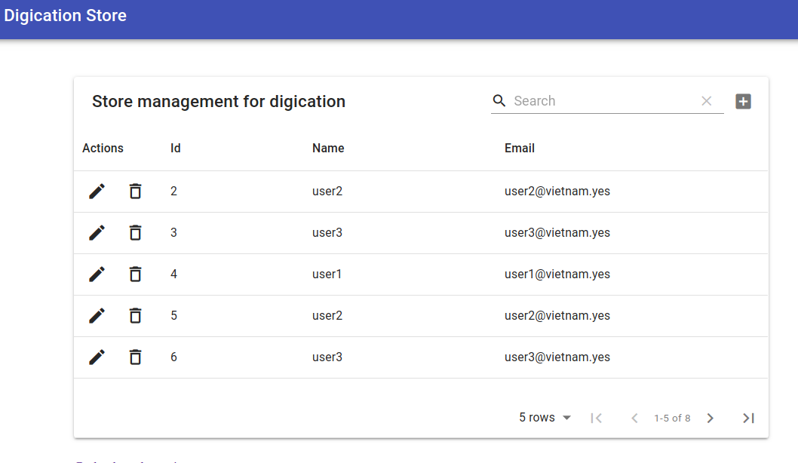

### 1 - Modeling Phase

As you can see it in here in this git repo.


Just simple as that.

### 2 - Coding Style

ES6/7/8/9 based syntax in nodejs and the browser bundled script transpiled to common cross browser polyfilled es2015 with babel.

### 3 - Backend Types

The first is a simple ***REST*** tech based, i used a simple module named ***finale*** that generate REST routes for every model and taking care of their associations which makes the request more consuming.
the second is a more advanced, lightweight and on demand ***Graphql*** based.

As you see the best more modern and efficient saving ***n+1*** requests per 1 time : ***Graphql*** is the winner here, i used the schema first approach to generate the api, ~~there is a code first approach which is so disgusting~~.


### 4 - React Based Frontend

As i didn't have much time for getting started in react with so much configuration... so lazy there, i used a more advanced very popular react based framework which is of course ***Gatsby.js*** for consuming the two seperate apis.

### 5 - Screenshots of these projects





### 6 - Commands to run the projects

```bash
npm start
```
in the 3 projects directories.

#### Thanks For your time ...
#### Waiting for feedback ...